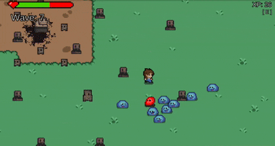

# Wavy

**Wavy is a wave-based pixel art survival game developed during a one-day school hackathon.**



## Table of Contents

* [Overview](#overview)
* [Demo](#demo)
* [Features](#features)
* [Requirements](#requirements)
* [Installation](#installation)
* [Usage](#usage)
* [Project Structure](#project-structure)
* [Known Issues](#known-issues)
* [Future Work](#future-work)
* [Contributing](#contributing)
* [License](#license)
* [Contact](#contact)

## Overview

Wavy challenges players to survive increasingly difficult waves of slime enemies on an infinite procedural map. Defeat slimes to earn experience points (XP), then allocate XP to upgrades in damage, speed, health, or healing. The game showcases fundamental Unity development including procedural generation, AI behavior, and combat mechanics.

## Demo

Play it live on Unity Play:  
https://play.unity.com/en/games/e1ffa6d4-4a72-4122-a6a7-e14b0a1fb984/wavy

## Features

* Infinite procedural map generation
* Three distinct slime enemy types (Basic, Tank, Boss)
* Progressive wave system with escalating difficulty
* Upgrade menu&#x20;
* XP and score tracking
* Animated pixel art sprites
* Quick restart

## Requirements

* Unity Editor 2021.3 LTS or later
* Windows 10 (Linux and macOS untested)

## Installation

1. Clone the repository:

   ```bash
   git clone https://github.com/Bob1883/WAVY
   cd wavy
   ```
2. Open the project in Unity Hub:

   * Click **Add** and select the cloned folder.
   * Open the project in Unity Editor.

## Usage

1. **Play**: Press the Play button in the Unity Editor or run the WebGL build.
2. **Controls**:

   * Move: W/A/S/D or Arrow keys
   * Attack: Space bar or mouse button
   * Open upgrade menu: E
   * Select upgrade: 1 (Damage), 2 (Speed), 3 (Health), 4 (Heal)
3. **Gameplay loop**: Defeat slimes to earn XP, spend XP on upgrades, survive as many waves as possible.

## Known Issues

* Game balance: player upgrades may outpace enemy difficulty scaling.
* Map persistence: unloaded chunks regenerate differently on reload.
* Hit detection: some attacks register multiple hits unexpectedly.
* Post-death input: player movement may continue briefly after death.
* Wave counter update: displays new wave count only after new wave.
* Score system: requires refinement to provide meaningful feedback.
* Performance: excessive enemy count can lead to application instability.

## Future Work

* Implement dynamic enemy scaling based on player statistics.
* Add boss waves and additional enemy types.
* Enable map state persistence across sessions.
* Refine UI and enhance graphical assets.
* Introduce attack cooldowns and improve hit detection algorithms.
* Optimize performance for large enemy counts.

## License

This project is licensed under the [MIT License](LICENSE).